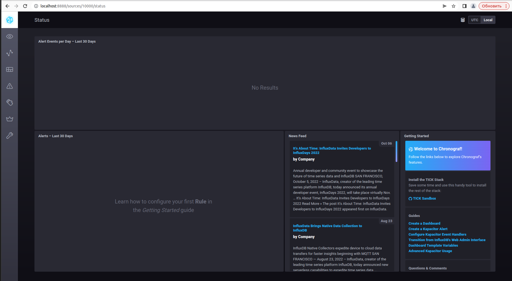
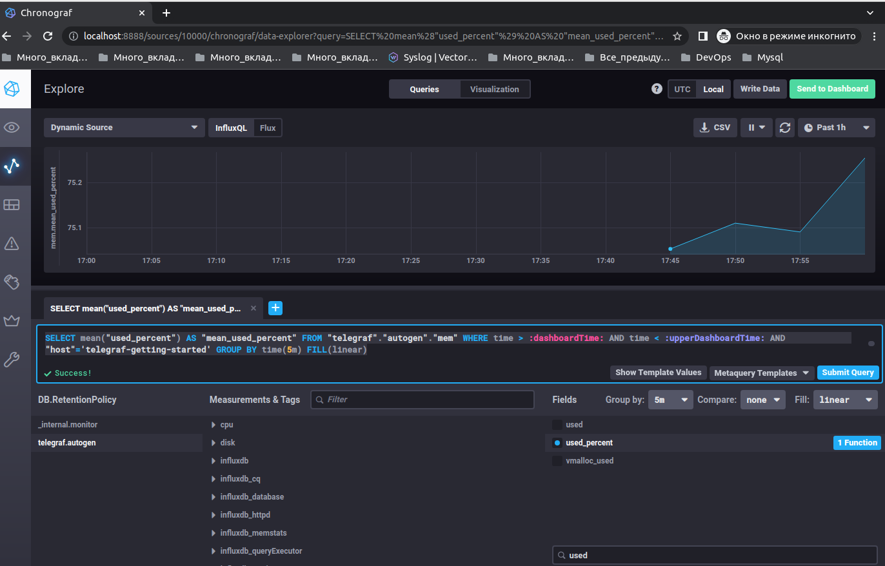
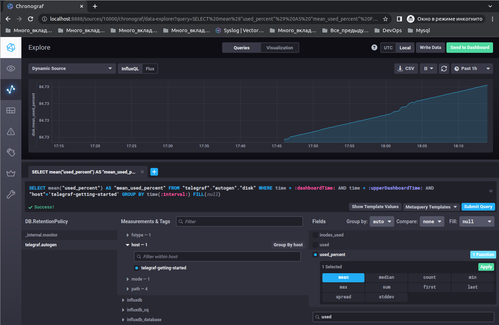
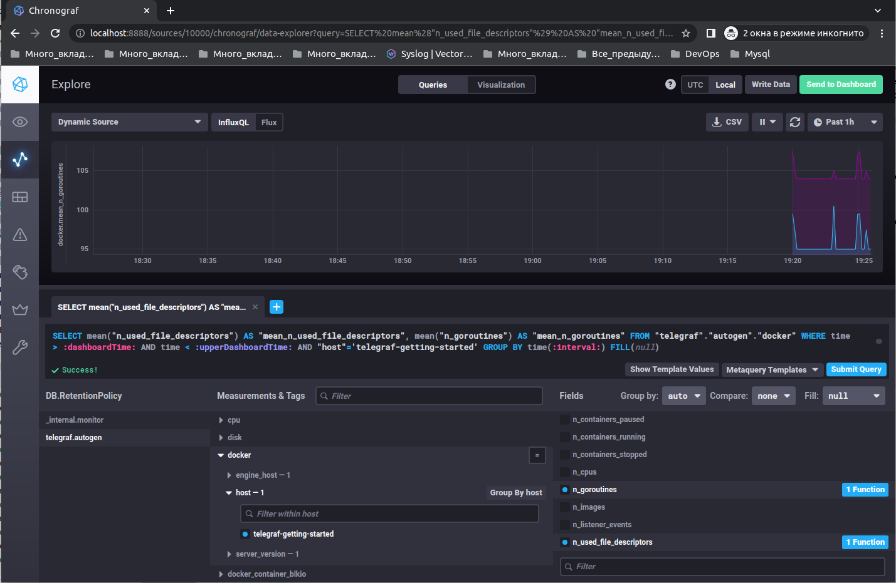
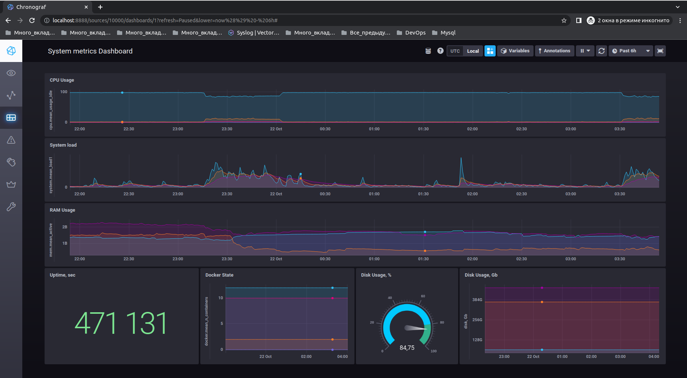

# Домашнее задание к занятию "10.02. Системы мониторинга"

## Обязательные задания

### 1. Опишите основные плюсы и минусы pull и push систем мониторинга.

#### Ответ:

    Push-модели: 
    Плюсы:
   ● Упрощение репликации данных в разные системы мониторинга или их резервные копии (на клиенте настраивается конечная точка отправки или набор таких точек)

   ● Более гибкая настройка отправки пакетов данных с метриками (на каждом клиенте задается объем данных и частоту отправки)

   ● UDP является менее затратным способом передачи данных, вследствие чего может вырасти производительность сбора метрик (обратной стороной медали является отсутствие гарантии доставки пакетов)

   ● Удобно использовать в динамически изменяемом окружении - после включения очередного хоста, он начинает передавать логи в систему мониторинга. 

   ● Есть возможность запускать события по получению определенных логов, не увеличивая частоту опроса со стороны системы мониторинга. 

    Минусы:
   ● При использовании UDP могут происходить потери пакетов, а соответственно и части логов.

   ● Настройка производится на каждом клиенте.

   ● Без дополнительной подготовки, возможны проблемы при смене ip адреса центрального сервера.
   
    Pull-модели:
    Плюсы:
   ● Легче контролировать подлинность данных (гарантия опроса только тех агентов, которые настроены в системе мониторинга)

   ● Можно настроить единый proxy-server до всех агентов с TLS (таким образом мы можем разнести систему мониторинга и агенты, с гарантией безопасности их взаимодействия)

   ● Упрощенная отладка получения данных с агентов (так как данные запрашиваются посредством HTTP, можно самостоятельно запрашивать эти данные, используя ПО вне системы мониторинга)

   ● В pull модели нет проблем с перегрузкой очередей т.к система мониторинга сама забирает данные, мониторинг никогда не станет узким местом системы.

    Минусы:
   ● Для работы в динамически изменяемом окружении, требуется какой-либо вариант система обнаружения сервисов.

   ● Каждый агент представляет из себя сервер, со всеми плюсами и минусами со стороны безпасности.

   ● Без прокси-сервера требуется настройка доступа к каждому клиенту за NAT.

### 2. Какие из ниже перечисленных систем относятся к push модели, а какие к pull? А может есть гибридные?

    - Prometheus -  <span style="color:green"> работает в соответствии с pull-моделью. Но компонент pushgateway_exporter для поддержки требований мониторинга в режиме push </span>
    - TICK - <span style="color:green"> работает в соответствии с push-моделью, также можно использовать pull-модель. </span>
    - Zabbix - <span style="color:green"> работает в соответствии с push и pull моделью. </span>
    - VictoriaMetrics - <span style="color:green"> работает в соответствии с push-моделью. </span>
    - Nagios - <span style="color:green"> работает в соответствии с pull-моделью. </span>

### 3. Склонируйте себе [репозиторий](https://github.com/influxdata/sandbox/tree/master) и запустите TICK-стэк, 
используя технологии docker и docker-compose.(по инструкции ./sandbox up )

```shell
:~/10-monitoring-02-systems/tick$ ./sandbox up

..........................................
..........................................

Successfully built 54869bb36823
Successfully tagged tick_documentation:latest
Creating tick_influxdb_1      ... done
Creating tick_documentation_1 ... done
Creating tick_kapacitor_1     ... done
Creating tick_telegraf_1      ... done
Creating tick_chronograf_1    ... done
Opening tabs in browser...
```

В виде решения на это упражнение приведите выводы команд с вашего компьютера (виртуальной машины):

    - curl http://localhost:8086/ping
    - curl http://localhost:8888
    - curl http://localhost:9092/kapacitor/v1/ping
#### Ответ:
```shell
:~$ curl -v http://localhost:8086/ping
*   Trying 127.0.0.1:8086...
* Connected to localhost (127.0.0.1) port 8086 (#0)
> GET /ping HTTP/1.1
> Host: localhost:8086
> User-Agent: curl/7.81.0
> Accept: */*
> 
* Mark bundle as not supporting multiuse
< HTTP/1.1 204 No Content
< Content-Type: application/json
< Request-Id: 32d83a53-4fea-11ed-807c-0242ac120102
< X-Influxdb-Build: OSS
< X-Influxdb-Version: 1.8.10
< X-Request-Id: 32d83a53-4fea-11ed-807c-0242ac120102
< Date: Wed, 19 Oct 2022 20:11:21 GMT
< 
* Connection #0 to host localhost left intact
```

```html
:~$ curl -v http://localhost:8086/ping
<!DOCTYPE html>
<html>
   <head>
      <link rel="stylesheet" href="/index.c708214f.css">
      <meta http-equiv="Content-type" content="text/html; charset=utf-8">
      <title>Chronograf</title>
      <link rel="icon shortcut" href="/favicon.70d63073.ico">
   </head>
      <body> <div id="react-root" data-basepath=""></div>
      <script type="module" src="/index.e81b88ee.js"></script>
      <script src="/index.a6955a67.js" nomodule="" defer></script>
      </body>
</html>
```

```shell
:~$ curl -v http://localhost:9092/kapacitor/v1/ping
*   Trying 127.0.0.1:9092...
* Connected to localhost (127.0.0.1) port 9092 (#0)
> GET /kapacitor/v1/ping HTTP/1.1
> Host: localhost:9092
> User-Agent: curl/7.81.0
> Accept: */*
> 
* Mark bundle as not supporting multiuse
< HTTP/1.1 204 No Content
< Content-Type: application/json; charset=utf-8
< Request-Id: e3ff5ba7-50b3-11ed-a429-0242ac120104
< X-Kapacitor-Version: 1.6.5
< Date: Thu, 20 Oct 2022 20:15:07 GMT
< 
* Connection #0 to host localhost left intact
```
А также скриншот веб-интерфейса ПО chronograf (`http://localhost:8888`). 



P.S.: если при запуске некоторые контейнеры будут падать с ошибкой - проставьте им режим `Z`, например
`./data:/var/lib:Z`

### 4. Изучите список [telegraf inputs](https://github.com/influxdata/telegraf/tree/master/plugins/inputs).
    - Добавьте в конфигурацию telegraf плагин - [disk](https://github.com/influxdata/telegraf/tree/master/plugins/inputs/disk):
    ```
    [[inputs.disk]]
      ignore_fs = ["tmpfs", "devtmpfs", "devfs", "iso9660", "overlay", "aufs", "squashfs"]
    ```
    - Так же добавьте в конфигурацию telegraf плагин - [mem](https://github.com/influxdata/telegraf/tree/master/plugins/inputs/mem):
    ```
    [[inputs.mem]]
    ```
    - После настройки перезапустите telegraf.
 
    - Перейдите в веб-интерфейс Chronograf (`http://localhost:8888`) и откройте вкладку `Data explorer`.
    - Нажмите на кнопку `Add a query`
    - Изучите вывод интерфейса и выберите БД `telegraf.autogen`
    - В `measurments` выберите mem->host->telegraf_container_id , а в `fields` выберите used_percent. 
    Внизу появится график утилизации оперативной памяти в контейнере telegraf.
    - Вверху вы можете увидеть запрос, аналогичный SQL-синтаксису. 
    Поэкспериментируйте с запросом, попробуйте изменить группировку и интервал наблюдений.


```shell
SELECT mean("used_percent") AS "mean_used_percent" FROM "telegraf"."autogen"."mem" WHERE time > :dashboardTime: AND time < :upperDashboardTime: AND "host"='telegraf-getting-started' GROUP BY time(5m) FILL(linear)
```

    - Приведите скриншот с отображением
    метрик утилизации места на диске (disk->host->telegraf_container_id) из веб-интерфейса.  



### 5. Добавьте в конфигурацию telegraf следующий плагин - [docker](https://github.com/influxdata/telegraf/tree/master/plugins/inputs/docker):
```
[[inputs.docker]]
  endpoint = "unix:///var/run/docker.sock"
```

Дополнительно вам может потребоваться донастройка контейнера telegraf в `docker-compose.yml` дополнительного volume и 
режима privileged:
```
  telegraf:
    image: telegraf:1.4.0
    privileged: true
    volumes:
      - ./etc/telegraf.conf:/etc/telegraf/telegraf.conf:Z
      - /var/run/docker.sock:/var/run/docker.sock:Z
    links:
      - influxdb
    ports:
      - "8092:8092/udp"
      - "8094:8094"
      - "8125:8125/udp"
```

После настройки перезапустите telegraf, обновите веб интерфейс и приведите скриншотом список `measurments` в 
веб-интерфейсе базы telegraf.autogen . Там должны появиться метрики, связанные с docker.

docker уже был в конфиге, в docker logs tick_telegraf_1 ошибка:
```shell
2022-10-21T15:34:55Z E! [inputs.docker] Error in plugin: Got permission denied while trying to connect to the Docker daemon socket at unix:///var/run/docker.sock: Get "http://%2Fvar%2Frun%2Fdocker.sock/v1.24/containers/json?filters=%7B%22status%22%3A%7B%22running%22%3Atrue%7D%7D&limit=0": dial unix /var/run/docker.sock: connect: permission denied
```
По рекомендации из задания добавил priveleged (использовал раньше) и :Z (возму на вооружение), перезагрузил контейнер, метрики появились.



Факультативно можете изучить какие метрики собирает telegraf после выполнения данного задания.

## Дополнительное задание (со звездочкой*) - необязательно к выполнению

В веб-интерфейсе откройте вкладку `Dashboards`. Попробуйте создать свой dashboard с отображением:

    - утилизации ЦПУ
    - количества использованного RAM
    - утилизации пространства на дисках
    - количество поднятых контейнеров
    - аптайм
    - ...
    - фантазируйте)
    
    ---



### Как оформить ДЗ?

Выполненное домашнее задание пришлите ссылкой на .md-файл в вашем репозитории.

---

